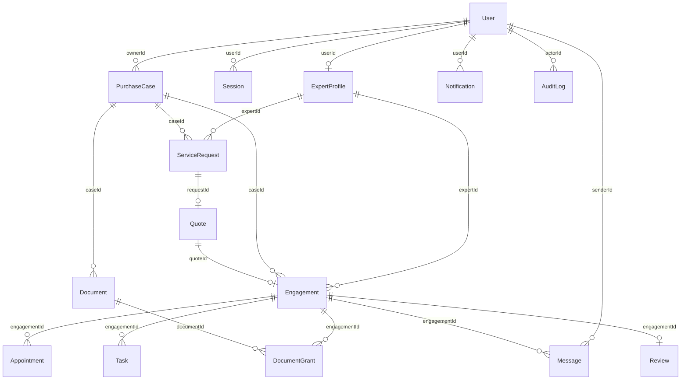

# 집이음 데이터 모델 명세
버전 1.0 | 2026-09-16 | PostgreSQL 기준 | API 필드명은 camelCase 그대로 매핑

## 1. 설계 범위와 공통 규칙
구매자-공인중개사-법무사-세무사 업무를 PurchaseCase 단위로 묶는다. 1개 계정은 1개 역할이며 EXPERT 계정은 1개 직군을 등록한다. ADMIN 계정은 운영자가 사전 생성한다. 상담만 이용해도 프로젝트를 만든다.

- 모든 PK는 UUID. createdAt은 서버 UTC timestamptz. UI에서는 Asia/Seoul로 표시한다.
- nullable=true 속성만 SQL NULL 허용. 나머지는 NOT NULL. 응답에는 nullable 속성도 항상 키를 포함한다.
- FK는 ON DELETE RESTRICT. 계정·프로젝트의 물리 삭제 API는 제공하지 않는다. 문서는 deletedAt으로 삭제 처리한다.
- OAS string enum은 SQL CHECK IN으로 구현한다. 금액은 원 단위 bigint이며 0 이상 1조 이하. float 사용 금지.
- 문자열 minLength/maxLength는 API와 DB CHECK(char_length())로 동일 적용. 앞뒤 공백을 제거하고 공백만 입력하면 거부한다.
- API에 노출하는 엔터티와 저장 필드를 구분한다. passwordHash·storageKey·Session·AuditLog는 공개하지 않는다.
- 토큰은 암호학적 난수로 만들고 해시만 저장한다. 세션 유효기간 24시간, 로그아웃/계정 정지 시 폐기한다.
- 삭제된 문서의 저장 객체는 보존정책에 따라 정리하며 신규 링크 발급 금지. 보존기간은 출시 시 별도 확정한다.

## 2. 핵심 ERD

### M:N 관계 해소
- PurchaseCase M:N ExpertProfile → ServiceRequest(견적 요청 이력), Engagement(선택 후 담당 관계).
- Document M:N Engagement → DocumentGrant(별도 문서 공유 권한).
- 구매자와 전문가의 직접 M:N FK 배열을 저장하지 않는다. 프로젝트와 연결 엔터티를 통해 조회한다.

### FK 및 부가 관계
표의 FK 열이 모든 실제 참조의 기준이다. User→Document(uploaderId), User→Review(authorId), User→DocumentGrant(grantedBy), User→ExpertProfile(verifiedBy), PurchaseCase/Engagement→Notification도 각각 1:N이며 verifiedBy와 알림의 두 FK는 nullable이다. AuditLog.targetId는 targetType에 따른 다형 참조라 DB FK를 걸지 않고 서비스에서 존재를 확인한다.

## User — 서비스 계정

| 속성/API 필드 | DB 타입 | NULL | 키·기본값·제약조건 | 의미 |
|---|---|---|---|---|
| id | uuid | 불가 | PK, UUID DEFAULT gen_random_uuid() | 식별자 |
| email | varchar(254) | 불가 | UNIQUE, 소문자 정규화; 최대길이 254 | - |
| name | varchar(50) | 불가 | 최소길이 1; 최대길이 50 | 표시 이름 |
| role | varchar(60) | 불가 | 가입 시 BUYER/EXPERT만 허용; CHECK IN BUYER, EXPERT, ADMIN | - |
| status | varchar(60) | 불가 | DEFAULT ACTIVE; CHECK IN ACTIVE, SUSPENDED | - |
| createdAt | timestamptz | 불가 | DEFAULT now() | 생성시각 |
| passwordHash (DB 전용) | varchar(255) | 불가 | NOT NULL; Argon2id 해시; API 응답 금지 | 응답 제외 |

## Session — 서버 세션(내부 저장 전용)

| 속성/API 필드 | DB 타입 | NULL | 키·기본값·제약조건 | 의미 |
|---|---|---|---|---|
| id | uuid | 불가 | PK, UUID DEFAULT gen_random_uuid() | 식별자 |
| userId | uuid | 불가 | FK User.id | - |
| tokenHash | varchar(128) | 불가 | UNIQUE; 원문 저장 금지; 최소길이 1; 최대길이 128 | 세션 토큰의 해시 |
| expiresAt | timestamptz | 불가 | - | - |
| revokedAt | timestamptz | 허용 | NULL 허용 | - |
| createdAt | timestamptz | 불가 | DEFAULT now() | 생성시각 |

## ExpertProfile — 전문가 공개 프로필과 검증상태

| 속성/API 필드 | DB 타입 | NULL | 키·기본값·제약조건 | 의미 |
|---|---|---|---|---|
| id | uuid | 불가 | PK, UUID DEFAULT gen_random_uuid() | 식별자 |
| userId | uuid | 불가 | FK User.id, UNIQUE | - |
| serviceType | varchar(60) | 불가 | CHECK IN BROKER, LEGAL, TAX | BROKER=공인중개사, LEGAL=법무사, TAX=세무사 |
| displayName | varchar(50) | 불가 | 최소길이 1; 최대길이 50 | 전문가 이름 |
| officeName | varchar(100) | 불가 | 최소길이 1; 최대길이 100 | 사무소명 |
| region | varchar(100) | 불가 | 최소길이 1; 최대길이 100 | 활동 시군구 |
| introduction | varchar(2000) | 불가 | 최소길이 1; 최대길이 2000 | 경력 및 전문 분야 |
| licenseNumber | varchar(80) | 불가 | UNIQUE(serviceType,licenseNumber); 최소길이 1; 최대길이 80 | 등록번호 |
| verificationStatus | varchar(60) | 불가 | DEFAULT PENDING; CHECK IN PENDING, VERIFIED, REJECTED, SUSPENDED | - |
| verificationReason | varchar(1000) | 허용 | NULL 허용; 최소길이 1; 최대길이 1000 | 심사 사유 |
| verifiedBy | uuid | 허용 | FK User.id (ADMIN), NULL 허용 | - |
| verifiedAt | timestamptz | 허용 | NULL 허용 | - |
| createdAt | timestamptz | 불가 | DEFAULT now() | 생성시각 |

## PurchaseCase — 구매 또는 상담 프로젝트

| 속성/API 필드 | DB 타입 | NULL | 키·기본값·제약조건 | 의미 |
|---|---|---|---|---|
| id | uuid | 불가 | PK, UUID DEFAULT gen_random_uuid() | 식별자 |
| ownerId | uuid | 불가 | FK User.id (BUYER) | - |
| title | varchar(100) | 불가 | 최소길이 1; 최대길이 100 | 프로젝트명 |
| purpose | varchar(60) | 불가 | 상담만 이용 가능; CHECK IN PURCHASE, CONSULTATION | - |
| region | varchar(100) | 불가 | 최소길이 1; 최대길이 100 | 희망 지역 |
| targetAddress | varchar(300) | 허용 | NULL 허용; 최소길이 1; 최대길이 300 | 후보 아파트 주소; 미정이면 null |
| budgetMin | bigint | 불가 | 최소 0; 최대 1000000000000 | 최소 예산(원) |
| budgetMax | bigint | 불가 | CHECK budgetMax >= budgetMin; 최소 0; 최대 1000000000000 | 최대 예산(원) |
| ownedHomeCount | bigint | 불가 | 최소 0; 최대 100 | 현재 세대 보유 주택 수 |
| fundingSource | varchar(60) | 불가 | CHECK IN SELF, LOAN, FAMILY, MIXED | - |
| ownershipPlan | varchar(60) | 불가 | CHECK IN SOLE, JOINT, UNDECIDED | - |
| contractPrice | bigint | 허용 | NULL 허용; 최소 0; 최대 1000000000000 | 계약 체결 후 실제 매매가(원) |
| closingDate | date | 허용 | NULL 허용 | 예정 잔금일 |
| status | varchar(60) | 불가 | DEFAULT ACTIVE; CHECK IN ACTIVE, COMPLETED, CANCELLED | - |
| version | bigint | 불가 | DEFAULT 1, CHECK >=1; 최소 1; 최대 2147483647 | 낙관적 잠금 버전 |
| updatedAt | timestamptz | 불가 | DEFAULT now() | - |
| createdAt | timestamptz | 불가 | DEFAULT now() | 생성시각 |

## ServiceRequest — 선택한 전문가 1명에게 보내는 상담·견적 요청 및 공유 동의

| 속성/API 필드 | DB 타입 | NULL | 키·기본값·제약조건 | 의미 |
|---|---|---|---|---|
| id | uuid | 불가 | PK, UUID DEFAULT gen_random_uuid() | 식별자 |
| caseId | uuid | 불가 | FK PurchaseCase.id | - |
| expertId | uuid | 불가 | FK ExpertProfile.id | - |
| summary | varchar(2000) | 불가 | 최소길이 1; 최대길이 2000 | 요청 내용 |
| shareConsent | boolean | 불가 | CHECK true; CHECK IN True | 이 전문가에게 프로젝트 정보 공유에 동의 |
| consentVersion | varchar(30) | 불가 | 현재 버전 2026-09-v1; 최소길이 1; 최대길이 30 | 동의문 버전 |
| consentedAt | timestamptz | 불가 | 서버 기록 | - |
| status | varchar(60) | 불가 | DEFAULT OPEN; CHECK IN OPEN, QUOTED, ACCEPTED, CANCELLED | - |
| createdAt | timestamptz | 불가 | DEFAULT now() | 생성시각 |

## Quote — 전문가의 업무 범위와 견적

| 속성/API 필드 | DB 타입 | NULL | 키·기본값·제약조건 | 의미 |
|---|---|---|---|---|
| id | uuid | 불가 | PK, UUID DEFAULT gen_random_uuid() | 식별자 |
| requestId | uuid | 불가 | FK ServiceRequest.id, UNIQUE | - |
| scope | varchar(2000) | 불가 | 최소길이 1; 최대길이 2000 | 포함 업무 |
| exclusions | varchar(2000) | 불가 | 최소길이 1; 최대길이 2000 | 제외 업무 및 실비 안내 |
| fee | bigint | 불가 | 최소 0; 최대 1000000000000 | 전문가 보수(원); VAT 제외 |
| vat | bigint | 불가 | 최소 0; 최대 1000000000000 | VAT(원) |
| estimatedExpenses | bigint | 불가 | 최소 0; 최대 1000000000000 | 예상 실비(원), 세금 납부액 확정 아님 |
| validUntil | timestamptz | 불가 | - | 견적 유효기한 |
| status | varchar(60) | 불가 | DEFAULT OFFERED; CHECK IN OFFERED, ACCEPTED, DECLINED | - |
| createdAt | timestamptz | 불가 | DEFAULT now() | 생성시각 |

## Engagement — 선택한 전문가와 프로젝트의 업무 연결

| 속성/API 필드 | DB 타입 | NULL | 키·기본값·제약조건 | 의미 |
|---|---|---|---|---|
| id | uuid | 불가 | PK, UUID DEFAULT gen_random_uuid() | 식별자 |
| caseId | uuid | 불가 | FK PurchaseCase.id | - |
| expertId | uuid | 불가 | FK ExpertProfile.id | - |
| quoteId | uuid | 불가 | FK Quote.id, UNIQUE | - |
| serviceType | varchar(60) | 불가 | ExpertProfile.serviceType과 일치; CHECK IN BROKER, LEGAL, TAX | BROKER=공인중개사, LEGAL=법무사, TAX=세무사 |
| status | varchar(60) | 불가 | DEFAULT ACTIVE; CHECK IN ACTIVE, COMPLETED | - |
| createdAt | timestamptz | 불가 | DEFAULT now() | 생성시각 |

## Appointment — 업무별 상담 예약

| 속성/API 필드 | DB 타입 | NULL | 키·기본값·제약조건 | 의미 |
|---|---|---|---|---|
| id | uuid | 불가 | PK, UUID DEFAULT gen_random_uuid() | 식별자 |
| engagementId | uuid | 불가 | FK Engagement.id | - |
| startsAt | timestamptz | 불가 | - | UTC ISO8601; UI는 Asia/Seoul 표시 |
| endsAt | timestamptz | 불가 | CHECK endsAt > startsAt | - |
| channel | varchar(60) | 불가 | CHECK IN VIDEO, PHONE, OFFLINE | - |
| contactInfo | varchar(500) | 불가 | 최소길이 1; 최대길이 500 | 전화번호, 회의 링크 또는 장소 |
| status | varchar(60) | 불가 | DEFAULT REQUESTED; CHECK IN REQUESTED, CONFIRMED, DECLINED, CANCELLED | - |
| reason | varchar(500) | 허용 | NULL 허용; 최소길이 1; 최대길이 500 | 거절/취소 사유 |
| createdAt | timestamptz | 불가 | DEFAULT now() | 생성시각 |

## Task — 선택된 업무별 체크리스트

| 속성/API 필드 | DB 타입 | NULL | 키·기본값·제약조건 | 의미 |
|---|---|---|---|---|
| id | uuid | 불가 | PK, UUID DEFAULT gen_random_uuid() | 식별자 |
| engagementId | uuid | 불가 | FK Engagement.id | - |
| title | varchar(100) | 불가 | 최소길이 1; 최대길이 100 | 업무명 |
| dueDate | date | 허용 | NULL 허용 | - |
| status | varchar(60) | 불가 | DEFAULT TODO; CHECK IN TODO, IN_PROGRESS, DONE | - |
| note | varchar(2000) | 허용 | NULL 허용; 최소길이 1; 최대길이 2000 | 진행 설명 |
| updatedAt | timestamptz | 불가 | DEFAULT now() | - |
| createdAt | timestamptz | 불가 | DEFAULT now() | 생성시각 |

## Document — 프로젝트 문서 메타데이터

| 속성/API 필드 | DB 타입 | NULL | 키·기본값·제약조건 | 의미 |
|---|---|---|---|---|
| id | uuid | 불가 | PK, UUID DEFAULT gen_random_uuid() | 식별자 |
| caseId | uuid | 불가 | FK PurchaseCase.id | - |
| uploaderId | uuid | 불가 | FK User.id | - |
| fileName | varchar(255) | 불가 | 최소길이 1; 최대길이 255 | 원본 파일명 |
| mimeType | varchar(60) | 불가 | CHECK IN application/pdf, image/jpeg, image/png | - |
| sizeBytes | bigint | 불가 | CHECK >0; 최소 1; 최대 10485760 | 최대 10MiB |
| category | varchar(60) | 불가 | CHECK IN CONTRACT, TAX, REGISTRATION, OTHER | - |
| deletedAt | timestamptz | 허용 | NULL 허용; 소프트 삭제 | - |
| createdAt | timestamptz | 불가 | DEFAULT now() | 생성시각 |
| storageKey (DB 전용) | varchar(500) | 불가 | NOT NULL UNIQUE; 외부 저장소 객체 키; API 응답 금지 | 응답 제외 |

## DocumentGrant — 선택한 업무 담당자에게 문서 공유

| 속성/API 필드 | DB 타입 | NULL | 키·기본값·제약조건 | 의미 |
|---|---|---|---|---|
| id | uuid | 불가 | PK, UUID DEFAULT gen_random_uuid() | 식별자 |
| documentId | uuid | 불가 | FK Document.id | - |
| engagementId | uuid | 불가 | FK Engagement.id | - |
| grantedBy | uuid | 불가 | FK User.id | - |
| revokedAt | timestamptz | 허용 | NULL 허용; 활성 UNIQUE(documentId,engagementId) | - |
| createdAt | timestamptz | 불가 | DEFAULT now() | 생성시각 |

## Message — 프로젝트 내 1:1 업무 대화

| 속성/API 필드 | DB 타입 | NULL | 키·기본값·제약조건 | 의미 |
|---|---|---|---|---|
| id | uuid | 불가 | PK, UUID DEFAULT gen_random_uuid() | 식별자 |
| engagementId | uuid | 불가 | FK Engagement.id | - |
| senderId | uuid | 불가 | FK User.id | - |
| body | varchar(4000) | 불가 | 수정/삭제 미지원; 최소길이 1; 최대길이 4000 | 텍스트 메시지 |
| createdAt | timestamptz | 불가 | DEFAULT now() | 생성시각 |

## Notification — 앱 내부 알림

| 속성/API 필드 | DB 타입 | NULL | 키·기본값·제약조건 | 의미 |
|---|---|---|---|---|
| id | uuid | 불가 | PK, UUID DEFAULT gen_random_uuid() | 식별자 |
| userId | uuid | 불가 | FK User.id | - |
| title | varchar(100) | 불가 | 최소길이 1; 최대길이 100 | 알림 제목 |
| body | varchar(1000) | 불가 | 최소길이 1; 최대길이 1000 | 알림 내용 |
| caseId | uuid | 허용 | FK PurchaseCase.id, NULL 허용 | - |
| engagementId | uuid | 허용 | FK Engagement.id, NULL 허용 | - |
| readAt | timestamptz | 허용 | NULL 허용 | - |
| createdAt | timestamptz | 불가 | DEFAULT now() | 생성시각 |

## Review — 완료 업무에 대한 구매자 후기

| 속성/API 필드 | DB 타입 | NULL | 키·기본값·제약조건 | 의미 |
|---|---|---|---|---|
| id | uuid | 불가 | PK, UUID DEFAULT gen_random_uuid() | 식별자 |
| engagementId | uuid | 불가 | FK Engagement.id, UNIQUE | - |
| authorId | uuid | 불가 | FK User.id; 프로젝트 소유자 | - |
| rating | integer | 불가 | 최소 1; 최대 5 | - |
| body | varchar(1000) | 불가 | 최소길이 1; 최대길이 1000 | 후기 |
| visibility | varchar(60) | 불가 | DEFAULT VISIBLE; CHECK IN VISIBLE, HIDDEN | - |
| moderationReason | varchar(500) | 허용 | NULL 허용; 최소길이 1; 최대길이 500 | 숨김/복구 사유 |
| createdAt | timestamptz | 불가 | DEFAULT now() | 생성시각 |

## AuditLog — 관리자 조치 감사 기록(내부 저장 전용)

| 속성/API 필드 | DB 타입 | NULL | 키·기본값·제약조건 | 의미 |
|---|---|---|---|---|
| id | uuid | 불가 | PK, UUID DEFAULT gen_random_uuid() | 식별자 |
| actorId | uuid | 불가 | FK User.id (ADMIN) | - |
| action | varchar(60) | 불가 | CHECK IN VERIFY_EXPERT, SET_USER_STATUS, MODERATE_REVIEW | - |
| targetType | varchar(60) | 불가 | CHECK IN ExpertProfile, User, Review | - |
| targetId | uuid | 불가 | 다형 참조; 서비스에서 대상 존재 검증 | 대상 식별자 |
| reason | varchar(1000) | 불가 | 최소길이 1; 최대길이 1000 | 처리 사유 |
| createdAt | timestamptz | 불가 | DEFAULT now() | 생성시각 |

## 3. 인덱스 및 트랜잭션 규칙

1. User.email UNIQUE, ExpertProfile.userId UNIQUE, ExpertProfile(serviceType,licenseNumber) UNIQUE.
2. ServiceRequest(caseId,expertId) 부분 UNIQUE WHERE status IN (OPEN,QUOTED,ACCEPTED). 완료 후 같은 전문가 재요청은 MVP에서 제외한다.
3. Quote.requestId UNIQUE, Engagement.quoteId UNIQUE, Review.engagementId UNIQUE.
4. Engagement(caseId,serviceType) 부분 UNIQUE WHERE status=ACTIVE. 다른 직군은 동시에 업무 가능.
5. DocumentGrant(documentId,engagementId) 부분 UNIQUE WHERE revokedAt IS NULL. 문서와 업무의 caseId 일치는 트랜잭션에서 검증한다.
6. 검색 인덱스: ExpertProfile(verificationStatus,serviceType,region), PurchaseCase(ownerId,createdAt,id), ServiceRequest(expertId,status), Engagement(expertId,status), Appointment(engagementId,startsAt), Task(engagementId), Document(caseId,deletedAt), Message(engagementId,createdAt,id), Notification(userId,readAt,createdAt), AuditLog(targetType,targetId,createdAt).
7. 견적 선택은 프로젝트 행 SELECT FOR UPDATE 후 원자 처리한다. 선택 견적/요청 승인, Engagement 생성, Task 생성, 같은 직군의 다른 열린 요청 취소, 해당 견적 거절, 알림 생성을 한 트랜잭션으로 묶는다. 재호출은 기존 Engagement 반환.
8. 예약 생성/확정은 ExpertProfile 행을 잠그고 해당 전문가의 모든 업무 예약에서 [startsAt,endsAt) 중복을 검사한다. REQUESTED/CONFIRMED만 시간 점유. 동시 요청 중 하나는 409.
9. 프로젝트 수정은 UPDATE ... WHERE id=? AND version=? 후 version+1. 0행 변경이면 409 STALE_VERSION.
10. 공유 동의: 요청 생성 시 shareConsent=true, 동의문 버전, 서버 시각 저장. 요청 취소 시 미선택 전문가의 프로젝트 접근 회수. 문서 접근은 별도 DocumentGrant.
11. Task 변경/업무완료와 알림 생성은 같은 DB 트랜잭션. 관리자 조치와 AuditLog도 같은 트랜잭션. 외부 알림 발송은 범위에서 제외.
12. 완료·취소 프로젝트에서는 신규 요청/예약/문서 업로드/메시지/업무 수정 불가. 과거 데이터 열람·다운로드·공유 철회·후기 작성은 허용. 문서 공유 신규 발급은 ACTIVE 업무만.
13. API 본문을 DB 행으로 직접 대입하지 않는다. 허용 입력 스키마만 사용하며 ownerId, senderId, uploaderId, authorId는 세션에서 지정한다.

## 4. 상태 전이와 자동 체크리스트
- PurchaseCase: ACTIVE → COMPLETED(모든 업무 완료·열린 요청 없음) 또는 CANCELLED(업무 연결 전). CANCELLED 처리 시 남은 요청 취소/견적 거절. 최소 1개 완료 업무가 있어야 COMPLETED.
- ServiceRequest: OPEN → QUOTED → ACCEPTED. OPEN/QUOTED → CANCELLED. 견적 만료는 validUntil로 계산하며 별도 상태를 저장하지 않는다.
- Quote: OFFERED → ACCEPTED 또는 DECLINED. OFFERED이더라도 validUntil<=현재시각이면 선택 불가.
- Engagement: ACTIVE → COMPLETED. 계약 해지·분쟁 중재는 MVP 제외; 완료된 업무를 다시 열지 않는다.
- Appointment: REQUESTED → CONFIRMED/DECLINED/CANCELLED; CONFIRMED → CANCELLED(시작 전 구매자). 종료시각 경과 여부는 파생 표시.
- ExpertProfile: 신규/반려 수정 → PENDING → VERIFIED/REJECTED; VERIFIED → SUSPENDED → VERIFIED. 중지 프로필은 신규 검색/견적 금지, 기존 업무 처리는 가능. 계정 SUSPENDED는 모든 API 이용 금지.
- BROKER Task: 구매조건 확인 / 후보 아파트 검토 / 계약 체결 지원 / 거래신고 확인 / 잔금 일정 확인.
- LEGAL Task: 등기 서류 확인 / 취득세 신고·납부 확인 / 소유권이전등기 접수 확인 / 등기 완료서류 전달.
- TAX Task: 상담자료 검토 / 상담 진행 / 검토 의견 전달.
- 자동 생성 Task는 모두 TODO, dueDate=null, note=null. 화면에서 담당 전문가가 기한·상태·설명을 갱신한다. 실제 신고/등기는 전문가가 외부에서 수행하고 여기서는 상태를 기록한다.

## 5. 저장하지 않는 파생 값과 API DTO
| 값 | 산출/원천 | 화면 |
|---|---|---|
| riskHints | ownedHomeCount>=1 → MULTI_HOME; fundingSource FAMILY/MIXED → FAMILY_FUNDS; ownershipPlan JOINT → JOINT_OWNERSHIP | S05 |
| 견적 예상 합계 | fee+vat+estimatedExpenses, 실제 세액 확정 아님 | S10/S20 |
| 진행률 | DONE Task 수 / 전체 Task 수; 0개면 0% | S12 |
| CaseDetail | PurchaseCase + 해당 사용자에게 허용된 Engagement[] + RiskHint[] | S05 |
| QuoteItem | Quote + 요청의 ExpertProfile + requestId | S10 |
| WorkSummary | 본인 OPEN/QUOTED 요청 수, ACTIVE 업무 수, REQUESTED 예약 수 | S19 |
| AdminSummary | PENDING 전문가 수, ACTIVE 사용자 수, VISIBLE 후기 수 | S22 |
| 목록 Page | items + meta(page,pageSize,total) | 모든 목록 |
| DownloadLink | storageKey에 대한 5분 임시 URL과 만료시각 | S13 |

## 6. 권한 규칙
- PUBLIC: 홈, 검증 전문가 검색/상세, 공개 후기, 가입/로그인.
- BUYER: 자기 프로젝트 및 요청·견적·업무만. 모든 변경은 소유권 확인.
- EXPERT: 자신에게 허용된 요청 프로젝트, 자기 Engagement 및 공유 문서만. 다른 전문가의 견적/대화 열람 불가.
- ADMIN: 계정상태, 전문가 검증, 후기 노출 관리. 거래문서·상담 내용 임의 열람 API 없음.
- User 응답은 /me 및 관리자 전용이다. 공개 ExpertProfile은 이메일·전화번호를 포함하지 않는다.
- ExpertProfile의 verifiedBy는 내부 관리자 식별용 UUID만 노출하며 관리자 개인정보는 조회 불가.

## 7. 화면·API·엔터티 추적
| 화면 | operationId | 주요 엔터티/DTO |
|---|---|---|
| S01 홈·시작 | 정적 화면 | - |
| S02 가입·로그인 | register, login | SessionUser |
| S03 내 프로젝트 목록 | listCases | PurchaseCasePage |
| S04 구매·상담 조건 등록 | createCase | CaseDetail |
| S05 프로젝트 대시보드 | getCase | CaseDetail |
| S06 프로젝트 수정·종료 | getCase, updateCase | CaseDetail |
| S07 전문가 검색 | listExperts | ExpertProfilePage |
| S08 전문가 상세·후기 | getExpert, listExpertReviews | ExpertProfile, ReviewPage |
| S09 상담·견적 요청 | listCases, getCase, createRequest | PurchaseCasePage, CaseDetail, ServiceRequest |
| S10 요청 현황·견적 비교 | listRequests, listQuotes, cancelRequest, acceptQuote | ServiceRequestPage, QuoteItemPage, ServiceRequest, Engagement |
| S11 예약 목록·요청 | listAppointments, createAppointment, updateAppointment | AppointmentPage, Appointment |
| S12 업무 체크리스트 | listTasks, updateTask, completeEngagement | TaskPage, Task, Engagement |
| S13 프로젝트 문서함 | listDocuments, uploadDocument, downloadDocument, deleteDocument | DocumentPage, Document, DownloadLink |
| S14 문서 공유 관리 | getCase, listGrants, shareDocument, revokeGrant | CaseDetail, DocumentGrantPage, DocumentGrant |
| S15 전문가와 업무 대화 | listMessages, sendMessage | MessagePage, Message |
| S16 알림함 | listNotifications, readNotification | NotificationPage, Notification |
| S17 내 정보·로그아웃 | getMe, updateMe, logout | User |
| S18 전문가 등록·심사 상태 | getMyExpert, applyExpert | ExpertProfile |
| S19 전문가 업무 홈 | workSummary, expertRequests, expertEngagements, expertQuotes, getCase | WorkSummary, ServiceRequestPage, EngagementPage, QuotePage, CaseDetail |
| S20 견적 작성 | getCase, createQuote | CaseDetail, Quote |
| S21 완료 후기 작성 | createReview | Review |
| S22 관리자 대시보드 | adminSummary | AdminSummary |
| S23 전문가 검증 관리 | adminExperts, verifyExpert | ExpertProfilePage, ExpertProfile |
| S24 계정·후기 운영 관리 | adminUsers, setUserStatus, adminReviews, moderateReview | UserPage, User, ReviewPage, Review |

## 8. 평가 확인
모든 엔터티 PK/FK/타입/NULL/제약 정의 완료. M:N 연결 엔터티 명시. UI의 입력·표시 데이터를 API DTO와 매핑. 본 파일은 01 PDF 및 03 YAML과 동일한 버전이다.